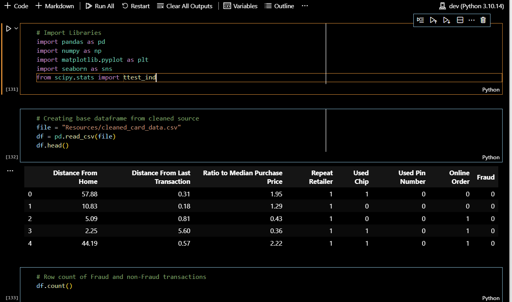

# Finance & Fraud Analysis

## Project Overview:

### Goal
The goal of this project is to perform an analysis on credit  
card data to determine the kind of transactions that are most 
likely to be flagged as fraudulent. Including columns that may 
or may not impact that likelihood. The following section has 
the specific questions we have posed to explore the dataset.

### Questions:
* Is there a correlation between distance from home and the last transaction?
    * Is there a difference in fraud rates for transactions occurring at different distances from the home or previous transaction?
* What is the impact of repeat retailer transactions on fraud likelihood?
    * Do first-time transactions at a new retailer have higher fraud rates compared to repeat transactions at previous retailers?
* How does the ratio to median purchase price affect the probability of a fraudulent transaction?
    * Are higher ratios to median purchase prices more indicative of fraud activity vs lower ratios?
* Distance Ratio vs Purchase Methods (Chip, Pin, repeat retail, online)?

### Dataset

For our group project we have decided to perform an analysis on [Credit Card Fraud](https://www.kaggle.com/datasets/dhanushnarayananr/credit-card-fraud). The provided
dataset has the following columns that will help us determine the answers to the above questions: 
* distance_from_home - the distance from home where the transaction happened.
* distance_from_last_transaction - the distance from last transaction happened.
* ratio_to_median_purchase_price - Ratio of purchased price transaction to median purchase price.
* repeat_retailer - Is the transaction happened from same retailer.
* used_chip - Is the transaction through chip (credit card).
* used_pin_number - Is the transaction happened by using PIN number.
* online_order - Is the transaction an online order.
* fraud - Is the transaction fraudulent?

## Dependencies and Usage:
This section list the dependencies for the project and 
how to install the notebooks.

### Dependencies
import pandas as pd
import numpy as np
import matplotlib.pyplot as plt
import seaborn as sns
from scipy.stats import ttest_ind, mannwhitneyu, stats

### Installation
Steps to install notebooks:
* Open github [repository](https://github.com/killerpennywise/project-1).
* Click green code button.
* Scroll down to download zip file.
* Open local downloads folder and right click *project-1-main.zip* file.
* Click and extract all to desired location.
* Open newly extracted **project-1-main** folder.
* Select desired notebook to run.

### Usage
To run a notebook simply click on the run all button at the top of the user's desired IDE or text editor.

## Results and Approach
The following section covers the summary and results of the 
teams' analysis on fraudulent and nonfraudulent credit card 
data.

### Results
* Is there a correlation between distance from home and the last transaction?
    * Is there a difference in fraud rates for transactions occurring at different distances from the home or previous transaction?
        * Approach: The goal was to determine correlations between distance data (distance from home or last transaction) and the occurrence of fraud by analyzing various features in the dataset to identify patterns indicating fraudulent activities.
        * Results: 
            * Transactions with a greater distance between them tend to have a higher likelihood of being fraudulent.
            * The average distance for fraudulent transactions is 5.75KM  while the average for non fraudulent transactions is 3.6 KM.
            * Fraud rates increase when the distance between transactions exceeds 50 KM.
* What is the impact of repeat retailer transactions on fraud likelihood?
    * Do first-time transactions at a new retailer have higher fraud rates compared to repeat transactions at previous retailers?
        * Results:
            * For Repeated Retailers there were 804611 Fraud transactions, 76925 Non Fraud Transactions. Out of the total 9.56% is fraudulent transactions
            * For online order there is 82711 fraud transactions, 567841 non-fraud transactions , 14.57% is percentage of fraudulent transactions
* How does the ratio to median purchase price affect the probability of a fraudulent transaction?
    * Are higher ratios to median purchase prices more indicative of fraud activity vs lower ratios?
        * Approach: In analyzing the correlation between the ratio to median purchase price and fraudulent transactions, the data was split into the only the necessary features (Ratio to Median Purchase Price and Fraud). Then checked the correlation and mean values for Ratio to Median Purchase Price between fraudulent transactions and nonfraudulent transactions and compared the two values. Then performing a t-test to ensure the two means are statistically significant.
        * Results:
            * Through some analysis and comparison, I have determined that the ratio to median purchase price does have some affect on the likelihood of a transaction being fraudulent. The correlation between the ratio to median purchase price and fraud is ~.5 positive correlation. Meaning that when the ratio to median purchase price is higher the more likely there will be fraud.
            * To answer this question I separated the data into two dataframes. One with fraudulent transactions and the other with non-fraudulent transactions. This allowed me to perform some basic statistics on the two datasets, more specifically calculate the mean of the two. Which shows that the fraudulent transactions tend to on average have higher ratios to median prices.
* Distance Ratio vs Purchase Methods (Chip, Pin, repeat retail, online)?
    * Approach: In assessing card transaction security using mag stripes, pin numbers or Europay, Mastercard and Visa (EMV) chips, the data was segmented into criteria to allow analysis based on each security feature and identify their relationship to preventing fraud.
    * Results:
        * In the transaction data set where the physical card was present, the mag stripe was used and the chip or PIN were not present the data shows 11% of the transactions in the data were fraudulent.
        * In the transaction data set where the physical card was present, a PIN number was used but a chip was not, the data indicates 0.03% of the transactions in the data were fraudulent.
        * In the transaction data set where the physical card was present, an EMV chip was used but a PIN number was not, the data indicates 6% of the transactions in the data were fraudulent.

# Licensing
### CC0: Public Domain

## Credit

### Angelina Prema
### Mark Moore
### Jack Hoffmann
### Nicholas Merz
